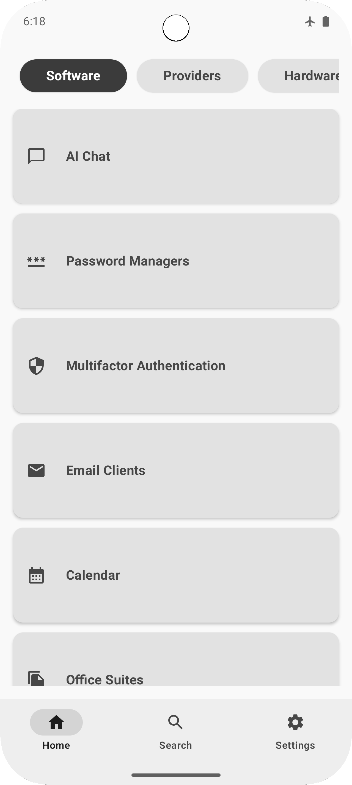
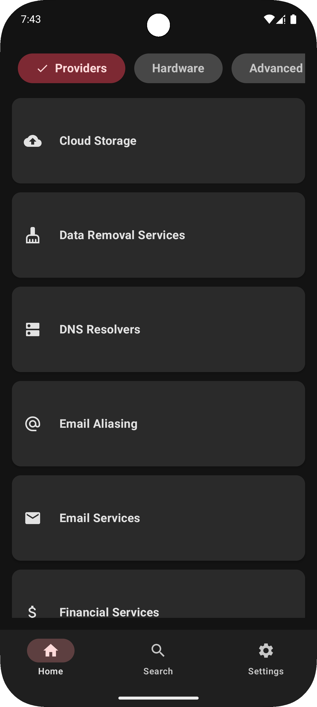
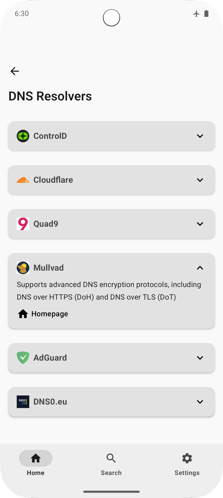
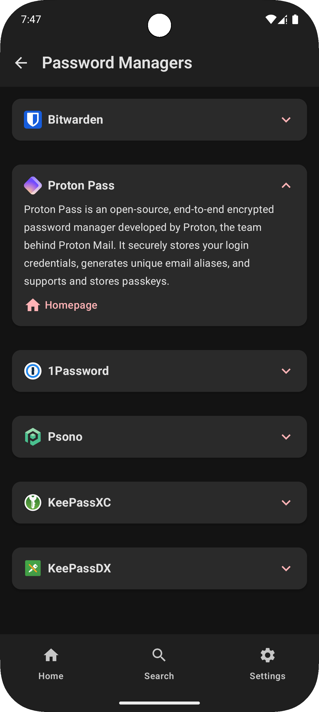
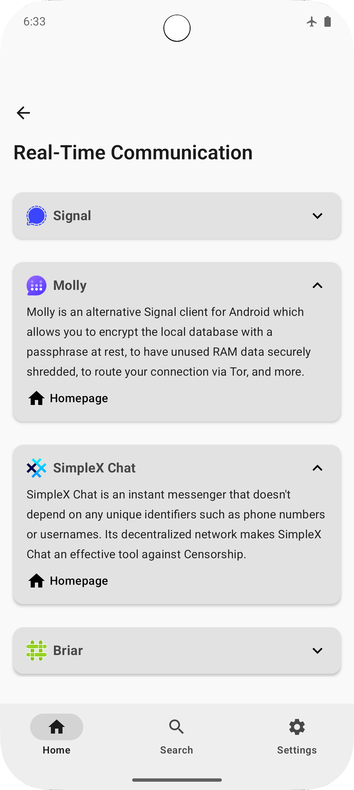
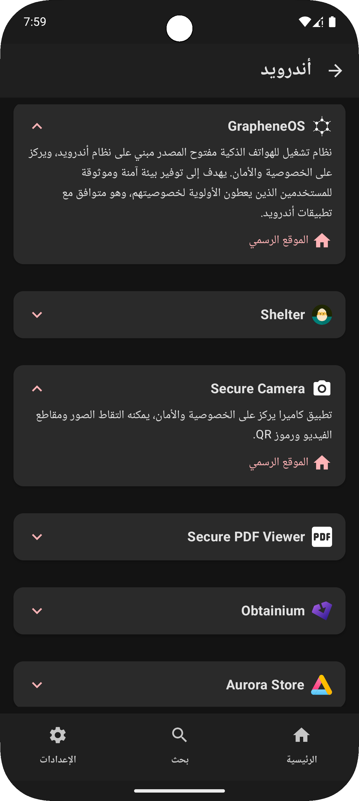

# Privacium

  
  
  
  
  
  
  
  <a href="https://github.com/kaleedtc/Privacium/releases/latest">
  
  <a href="https://ko-fi.com/Z8Z31RUEUU">
  

---
An open-source app built to guide you through the world of digital privacy. Discover privacy-respecting software and services, all based on the standard criteria of [privacyguides.org](https://www.privacyguides.org).
This app is built with modern Android technologies, including Kotlin and Jetpack Compose, to provide a clean experience.

---
## ✨ Features
- **🔒 Privacy First:** No ads, no tracking, no permissions requested.
- **🎨 Dynamic Theming:** Automatically adapts to your wallpaper and system theme on Android 12 and newer.
- **🌍 Full RTL Support:** Perfect usability for right-to-left languages like Arabic.
- **🚀 Modern UI:** A clean and responsive user interface built entirely with Jetpack Compose.
- **❤️ FOSS:** 100% Free and Open-Source Software.
- **📚 Trusted Information:** All recommendations and guides are based on the criteria from the [Privacy Guides](https://www.privacyguides.org) team.

---

## 📥 Installation
Privacium is available to download from the official [GitHub Releases page](https://github.com/kaleedtc/Privacium/releases), but you can also keep track of updates with [Obtainium](https://github.com/ImranR98/Obtainium#-obtainium).

<a href="https://apps.obtainium.imranr.dev/redirect?r=obtainium://add/https://github.com/kaleedtc/Privacium">

---

## Screenshots
|  |  |  |
| ------------------------------------------------------------- | -------------------------------------------------------------------- | ------------------------------------------------------------------------ |
|    |   |   |

---

## 🌐 Translations
You can help translate Privacium into your language using [Weblate](https://translate.codeberg.org/projects/privacium/).

You will need an account to update translations and add languages.
Add the language you want to translate to in Languages -> Manage translated languages in the top menu bar.

---

## 🛠️ Built With
- [Kotlin](https://kotlinlang.org/): First-party and official programming language for Android development.
- [Jetpack Compose](https://developer.android.com/jetpack/compose): Android’s modern toolkit for building native UI.
- [Material 3 Components](https://m3.material.io/): The latest design system for building beautiful, usable products.

---

> [!IMPORTANT]  
> We strongly encourage you to review the full details, criteria, and discussions for each recommendation on the official [**Privacy Guides website**](https://www.privacyguides.org) before making any decisions.

---

## 📜 License
This project is distributed under the MIT License. See [LICENSE](https://github.com/kaleedtc/Privacium/blob/main/LICENSE) for more information.

## 🙏 Acknowledgments
- A huge thanks to the entire team at [**Privacy Guides**](https://www.privacyguides.org) for their work and for maintaining the standards that this app relies on.
- All the contributors who will help make this app better.

## Donate
If you find Privacium valuable, please consider donating to the project via options below:

<noscript></noscript>

**BTC:**
`bc1q92235uhffydjj5w5av3fs96vn0n6g0zprx7rhk`

**BCH:**
`qqsnx346jfddmvtqws5kmadlrut4vk7fg5hxysldfe`

**LTC:**
`ltc1q3ck68nwpj8zm7qsxegsvjxcayatsj7duze2zvn`

**XMR:**
`46Sc8LznRrhQz6Qwng12RZ13W3V6tj5LDF7cJJ5yL7Li62vfLDFBktbcZ2wqk3XmDS3dkRVfcFd65LwSJEw1Xigp3HETSz5`
