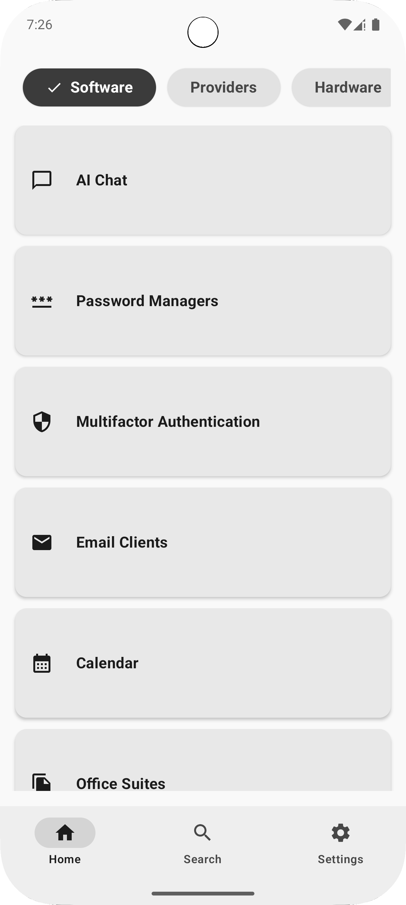

# Privacium
An open-source android app built to guide you through the world of digital privacy. Discover privacy-respecting software and services, all based on the standard criteria of [privacyguides.org](https://www.privacyguides.org).
This app is built with modern Android technologies, including Kotlin and Jetpack Compose, to provide a clean experience.

---
## ✨ Features
- **🔒 Privacy First:** No ads, no tracking, no permissions requested.
- **🎨 Dynamic Theming:** Automatically adapts to your wallpaper and system theme on Android 12 and newer.
- **🌍 Full RTL Support:** Perfect usability for right-to-left languages like Arabic.
- **🚀 Modern UI:** A clean and responsive user interface built entirely with Jetpack Compose.
- **❤️ FOSS:** 100% Free and Open-Source Software.
- **📚 Trusted Information:** All recommendations and guides are based on the criteria from the [Privacy Guides](https://www.privacyguides.org) team.

---

## 📥 Installation
Privacium is available to download from the official [github releases page](https://github.com/kaleedtc/Privacium/releases), but you can also keep track of updates with [Obtainium](https://github.com/ImranR98/Obtainium#-obtainium):

- **F-Droid** (Coming Soon)

---

## Screenshots
|  |  |  |
| ------------------------------------------------------------- | -------------------------------------------------------------------- | ------------------------------------------------------------------------ |
|    |   |   |

---

## 🛠️ Built With
- [Kotlin](https://kotlinlang.org/): First-party and official programming language for Android development.
- [Jetpack Compose](https://developer.android.com/jetpack/compose): Android’s modern toolkit for building native UI.
- [Material 3 Components](https://m3.material.io/): The latest design system for building beautiful, usable products.

---

> [!IMPORTANT]  
> We strongly encourage you to review the full details, criteria, and discussions for each recommendation on the official [**Privacy Guides website**](https://www.privacyguides.org) before making any decisions.

---

## 📜 License
This project is distributed under the MIT License. See [LICENSE](https://github.com/kaleedtc/Privacium/blob/main/LICENSE) for more information.

## 🙏 Acknowledgments
- A huge thanks to the entire team at [**Privacy Guides**](https://www.privacyguides.org) for their work and for maintaining the standards that this app relies on.
- All the contributors who will help make this app better.
